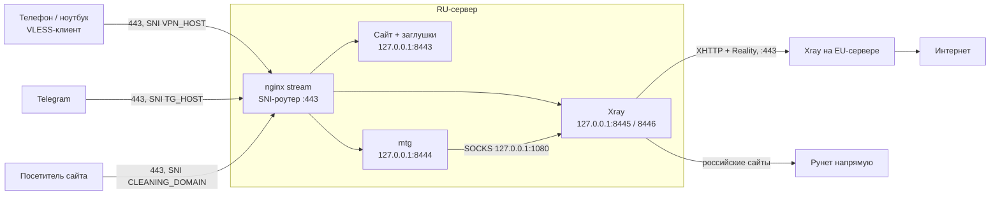

# Telegram-прокси и VPN: RU-сервер + европейский сервер

Актуально на 23 сентября 2026

## Схема

Устройство подключается к RU-серверу по VLESS+Reality, RU-сервер передаёт трафик на европейский сервер по VLESS+XHTTP+Reality, оттуда он уходит в интернет. Telegram-прокси (mtg) стоит на RU-сервере и использует тот же туннель. Российские сайты выходят с RU-сервера напрямую, минуя Европу.



nginx на порту 443 смотрит только на имя домена (SNI) в начале TLS-соединения и раздаёт подключения по локальным портам. Снаружи на RU-сервере открыты только 443, 80 и SSH.

### Принципы, на которых всё построено

- **Один туннель RU → EU для VPN и Telegram.** Два отдельных туннеля всё равно шли между одними и теми же IP, так что независимость была мнимой, а сложность — реальной.
- **Self-steal везде.** Каждое имя, которое видит ТСПУ, — ваш домен с A-записью на этот же сервер, настоящим сертификатом Let's Encrypt и сайтом-заглушкой. SNI и IP всегда совпадают.
- **XHTTP на межсерверном хопе** вместо TCP+mux и на стандартном порту 443.
- **Три профиля для устройств:** основной (VLESS+Reality+Vision), запасной (XHTTP через RU) и аварийный (XHTTP напрямую в Европу, если заблокируют RU-сервер).
- **Docker с `network_mode: host`** на обоих серверах: порты видны в `ss` как есть, а ufw работает без обходов через iptables Docker.

Допущение: сайт клининга остаётся на RU-сервере. Помните, что блокировка IP RU-сервера или претензия хостера заденет и сайт.

### Где выполнять команды

В конце каждого заголовка указано, где выполняются команды раздела:

| Метка | Где |
| --- | --- |
| **EU** | европейский сервер |
| **RU** | российский сервер (где сайт клининга) |
| **оба сервера** | одно и то же на EU и на RU |
| **ваш компьютер** | ноутбук, с которого вы заходите на серверы |
| **устройства** | телефоны и компьютеры, которые подключаются к VPN |

В блоках кода, где команды идут на разных машинах, это подписано комментарием, например `# RU-сервер`. Удобно держать открытыми два окна терминала и подписать их.

## Подготовка

До начала нужны один новый домен для EU-сервера, четыре DNS-записи и набор ключей. Маски RU-сервера делаются на поддоменах сайта клининга, покупать для них ничего не нужно.

### Домены и DNS — панель DNS и ваш компьютер

Маски RU-сервера — поддомены `CLEANING_DOMAIN`. Сайт и прокси и так стоят на одном IP, поэтому новой связи между ними это не добавляет. Для EU-сервера купите один отдельный домен в любой нероссийской зоне (`.com`, `.net`, `.xyz` и т.п.). Тогда европейский сервер не будет связан с клинингом в публичном DNS и логах сертификатов. Названия выбирайте нейтральные, без `vpn`, `proxy`, `tg`.

| Имя в панели | Тип | Значение | TTL | В какой зоне | Плейсхолдер |
| --- | --- | --- | --- | --- | --- |
| `static` | A | `RU_IP` | 300 | `CLEANING_DOMAIN` | `TG_HOST` = `static.CLEANING_DOMAIN` |
| `media` | A | `RU_IP` | 300 | `CLEANING_DOMAIN` | `VPN_HOST` = `media.CLEANING_DOMAIN` |
| `api` | A | `RU_IP` | 300 | `CLEANING_DOMAIN` | `VPN2_HOST` = `api.CLEANING_DOMAIN` |
| `@` (корень) | A | `EU_IP` | 300 | новый домен | `EU_HOST` = новый домен целиком, напр. `northstudio.fun` |

Если у сайта клининга уже используются поддомены `static`, `media` или `api`, возьмите другие нейтральные имена: `cdn`, `img`, `files`.

#### Шаг 1. Узнайте, где управляется DNS

Записи правятся не обязательно у регистратора, а там, куда указывают NS-серверы домена. Это может быть регистратор, хостинг или Cloudflare. Проверьте с любого компьютера:

```bash
dig NS CLEANING_DOMAIN +short
# Windows: nslookup -type=NS CLEANING_DOMAIN
```

По именам NS-серверов обычно видно компанию: в них стоит домен регистратора, хостинга или `ns.cloudflare.com`. В панели именно этой компании и нужно добавлять записи. Если NS указывают на хостинг, а вы зайдёте в DNS у регистратора, изменения ни на что не повлияют.

#### Шаг 2. Записи для поддоменов клининга

1. Войдите в панель, найденную на шаге 1, откройте домен `CLEANING_DOMAIN` и раздел «DNS-записи», «Управление зоной» или «DNS-редактор».
2. Посмотрите, как записаны уже существующие записи. Большинство панелей ждут в поле имени только поддомен (`static`), но некоторые — полное имя (`static.CLEANING_DOMAIN`, иногда с точкой на конце). Пишите так же, как там.
3. Нажмите «Добавить запись», выберите тип `A`, в имени укажите `static`, в значении — `RU_IP`, TTL — 300 секунд. Если TTL не меняется, оставьте значение по умолчанию.
4. Сохраните и повторите для `media` и `api`.

Существующие записи (`@`, `www`, `MX`, `TXT`) не трогайте: от них зависят сайт и почта. Если в зоне есть запись `*` (wildcard), это не мешает: явные записи для `static`, `media`, `api` важнее неё.

#### Шаг 3. Новый домен для EU-сервера

1. Купите домен у любого регистратора, который продаёт международные зоны. Если регистратор предлагает скрытие данных владельца в WHOIS (WHOIS privacy), включите его.
2. Оставьте DNS у регистратора, по умолчанию так и будет.
3. Откройте DNS-записи нового домена. Регистраторы часто сами создают записи для страницы-«парковки»: `A @` на свой IP и `CNAME www`. Удалите их. Если оставить старую `A @`, у домена окажется два адреса и часть подключений уйдёт на парковку.
4. Добавьте запись `A`, имя `@` (корень домена), значение `EU_IP`, TTL 300.
5. Записи `AAAA` не создавайте. Если панель добавила такую сама, удалите её.

Если DNS нового домена у Cloudflare, у записи обязательно выключите проксирование: переключатель Proxy status в положение **DNS only** (серое облачко). С оранжевым облачком Cloudflare сам принимает TLS-подключения, и Reality перестаёт работать.

#### Шаг 4. Проверьте CAA-записи

CAA-запись указывает, каким удостоверяющим центрам разрешено выпускать сертификаты для домена.

```bash
dig CAA CLEANING_DOMAIN +short
dig CAA EU_HOST +short
```

Пустой вывод — всё в порядке. Если записи есть, но среди них нет `letsencrypt.org`, добавьте ещё одну: тип `CAA`, имя `@`, значение `0 issue "letsencrypt.org"`. Иначе certbot не сможет выпустить сертификаты.

#### Шаг 5. Убедитесь, что записи работают

```bash
dig +short static.CLEANING_DOMAIN      # RU_IP
dig +short media.CLEANING_DOMAIN       # RU_IP
dig +short api.CLEANING_DOMAIN         # RU_IP
dig +short EU_HOST                     # EU_IP
dig +short EU_HOST @1.1.1.1            # то же через публичный резолвер
```

Новые записи в существующей зоне обычно появляются за несколько минут. Только что купленный домен может заработать через несколько часов, иногда до суток. Не запускайте certbot, пока `dig` не вернёт правильный IP: у Let's Encrypt есть лимиты на неудачные попытки проверки, и можно на время заблокировать себе выпуск сертификата.

### Плейсхолдеры

Везде ниже замените значения `КАПСОМ` на свои. Храните их в менеджере паролей, а не в заметках или чатах.

| Плейсхолдер | Что это | Как получить |
| --- | --- | --- |
| `RU_IP`, `EU_IP` | IP серверов | панель хостера |
| `SSH_PORT` | новый порт SSH, напр. `2222` | придумать |
| `EU_UUID` | «пользователь» RU-сервера на EU-сервере | `xray uuid` |
| `EMERGENCY_UUID` | аварийный профиль устройства напрямую на EU | `xray uuid` |
| `UUID_PHONE`, `UUID_LAPTOP` | по одному UUID на устройство | `xray uuid` |
| `RU_PRIVATE_KEY` / `RU_PUBLIC_KEY` | ключи Reality RU-сервера | `xray x25519` |
| `EU_PRIVATE_KEY` / `EU_PUBLIC_KEY` | ключи Reality EU-сервера | `xray x25519` |
| `RU_SHORT_ID`, `EU_SHORT_ID` | short ID Reality | `openssl rand -hex 8` |
| `RU_XHTTP_PATH`, `EU_PATH` | пути XHTTP, напр. `/api/v2/3f9c2a71` | `openssl rand -hex 4` + свой префикс |
| `MTG_SECRET` | секрет Telegram-прокси | шаг 3.2 |

### Версии

Версия Xray должна совпадать на обоих серверах и быть не старее, чем в клиентах: Reality и XHTTP меняются от версии к версии. На момент написания актуальная версия Xray — 26.3.27. Образ используем `teddysun/xray:26.3.27`: в нём уже лежат файлы `geoip.dat` и `geosite.dat`, нужные для маршрутизации. Если такого тега нет на Docker Hub, возьмите ближайший свежий и используйте его везде. Для mtg — `ghcr.io/9seconds/mtg:2`.

### Генерация ключей вручную — EU

Проще всего сгенерировать всё одной командой скрипта из следующего раздела. Ниже — ручной способ: выполните команды на любом сервере после установки Docker (шаг 1.1) и сразу запишите результаты в таблицу плейсхолдеров.

```bash
XRAY=teddysun/xray:26.3.27

# UUID: выполнить 4 раза → EU_UUID, EMERGENCY_UUID, UUID_PHONE, UUID_LAPTOP
docker run --rm $XRAY xray uuid

# Ключи Reality: выполнить 2 раза → набор RU_* и набор EU_*
docker run --rm $XRAY xray x25519
# PrivateKey → *_PRIVATE_KEY
# Password (в старых версиях — Public key) → *_PUBLIC_KEY

# Short ID: 2 раза → RU_SHORT_ID, EU_SHORT_ID
openssl rand -hex 8

# Хвосты путей XHTTP: 2 раза
openssl rand -hex 4
```

Если устройств больше двух, сгенерируйте по UUID на каждое. Так можно отключить одно устройство, не трогая остальные.

### Файл значений и скрипт vpnctl.sh

Все значения схемы хранятся в одном файле `/root/vpn.env`, одинаковом на обоих серверах. Скрипт `vpnctl.sh` генерирует ключи и секреты, подставляет значения в конфиги, ведёт список устройств и собирает для них ссылки и QR-коды. Главная копия файла живёт на RU-сервере: там вы добавляете устройства и выдаёте ссылки.

#### Шаг 1. Установка скрипта — EU

Выполните на EU-сервере после шага 1.1 (нужен Docker). Скрипт также приложен отдельным файлом `vpnctl.sh`.

```bash
apt install -y jq qrencode
nano /usr/local/bin/vpnctl.sh      # вставить текст скрипта ниже, сохранить
chmod +x /usr/local/bin/vpnctl.sh
vpnctl.sh                          # покажет список команд
```

Текст скрипта:

```bash
#!/usr/bin/env bash
# vpnctl.sh — все значения схемы в одном файле, подстановка в конфиги,
# список устройств и готовые ссылки/QR-коды для подключения.
set -euo pipefail

ENV_FILE="${VPN_ENV:-/root/vpn.env}"
OUT_DIR="${VPN_OUT:-/root/vpn-links}"
MTG_IMAGE="ghcr.io/9seconds/mtg:2"

die() { echo "Ошибка: $*" >&2; exit 1; }

load() {
  [ -f "$ENV_FILE" ] || die "нет файла $ENV_FILE (создайте его по шаблону)"
  set -a
  # shellcheck source=/dev/null
  . "$ENV_FILE"
  set +a
  XRAY_IMAGE="${XRAY_IMAGE:-teddysun/xray:26.3.27}"
}

# Записать KEY="value" в файл значений: заменить строку или добавить в конец
set_var() {
  local key="$1" val="$2"
  if grep -q "^${key}=" "$ENV_FILE"; then
    sed -i "s|^${key}=.*|${key}=\"${val}\"|" "$ENV_FILE"
  else
    printf '%s="%s"\n' "$key" "$val" >> "$ENV_FILE"
  fi
}

gen_uuid() { docker run --rm "$XRAY_IMAGE" xray uuid; }

# Печатает "приватный публичный". Понимает старый (Private/Public key)
# и новый (PrivateKey/Password) формат вывода xray x25519.
gen_pair() {
  docker run --rm "$XRAY_IMAGE" xray x25519 | awk -F': *' '
    /[Pp]rivate/            { priv = $2 }
    /Password|[Pp]ublic/    { pub  = $2 }
    END { print priv, pub }'
}

qr_png() { if command -v qrencode >/dev/null; then qrencode -o "$2" "$1"; fi; }

cmd_init() {
  load
  local v a b
  for v in RU_IP EU_IP CLEANING_DOMAIN TG_HOST VPN_HOST VPN2_HOST EU_HOST; do
    [ -n "${!v:-}" ] || die "сначала заполните $v в $ENV_FILE"
  done
  command -v docker >/dev/null || die "нужен Docker (шаг 1.1)"
  [ -n "${EU_UUID:-}" ]        || set_var EU_UUID "$(gen_uuid)"
  [ -n "${EMERGENCY_UUID:-}" ] || set_var EMERGENCY_UUID "$(gen_uuid)"
  if [ -z "${RU_PRIVATE_KEY:-}" ]; then
    read -r a b <<<"$(gen_pair)"; set_var RU_PRIVATE_KEY "$a"; set_var RU_PUBLIC_KEY "$b"
  fi
  if [ -z "${EU_PRIVATE_KEY:-}" ]; then
    read -r a b <<<"$(gen_pair)"; set_var EU_PRIVATE_KEY "$a"; set_var EU_PUBLIC_KEY "$b"
  fi
  [ -n "${RU_SHORT_ID:-}" ]   || set_var RU_SHORT_ID "$(openssl rand -hex 8)"
  [ -n "${EU_SHORT_ID:-}" ]   || set_var EU_SHORT_ID "$(openssl rand -hex 8)"
  [ -n "${RU_XHTTP_PATH:-}" ] || set_var RU_XHTTP_PATH "/api/v2/$(openssl rand -hex 4)"
  [ -n "${EU_PATH:-}" ]       || set_var EU_PATH "/assets/$(openssl rand -hex 4)"
  [ -n "${MTG_SECRET:-}" ]    || set_var MTG_SECRET "$(docker run --rm "$MTG_IMAGE" generate-secret --hex "$TG_HOST" | tail -n1)"
  chmod 600 "$ENV_FILE"
  echo "Готово: пустые значения сгенерированы и записаны в $ENV_FILE"
  echo "Уже заполненные значения не менялись."
}

cmd_add_device() {
  local name="${1:-}" id
  [ -n "$name" ] || die "укажите имя: vpnctl.sh add-device mama-phone"
  [[ "$name" =~ ^[A-Za-z0-9_-]+$ ]] || die "имя только латиницей, цифрами, «-» и «_»"
  load
  case " ${DEVICES:-} " in *" $name="*) die "устройство $name уже есть" ;; esac
  id="$(gen_uuid)"
  set_var DEVICES "$(echo "${DEVICES:-} $name=$id" | xargs)"
  echo "Добавлено: $name ($id)"
  echo "Дальше: vpnctl.sh sync-clients, затем перезапуск xray"
}

cmd_remove_device() {
  local name="${1:-}" out="" pair
  [ -n "$name" ] || die "укажите имя: vpnctl.sh remove-device mama-phone"
  load
  for pair in ${DEVICES:-}; do [ "${pair%%=*}" = "$name" ] || out="$out $pair"; done
  set_var DEVICES "$(echo "$out" | xargs)"
  rm -f "$OUT_DIR/$name".txt "$OUT_DIR/$name"-*.png
  echo "Удалено: $name. Дальше: vpnctl.sh sync-clients, затем перезапуск xray"
}

# Заменяет плейсхолдеры (RU_IP, EU_HOST, …) в файлах на значения из vpn.env
cmd_render() {
  [ $# -gt 0 ] || die "укажите файлы: vpnctl.sh render /opt/xray/config.json"
  load
  local names f n v
  # длинные имена первыми, чтобы EU_PATH не задел EU_PATH_ENCODED и т.п.
  names="$(grep -oE '^[A-Z0-9_]+=' "$ENV_FILE" | tr -d '=' \
           | awk '{ print length, $0 }' | sort -rn | cut -d' ' -f2)"
  for f in "$@"; do
    [ -f "$f" ] || die "нет файла $f"
    cp "$f" "$f.bak"
    for n in $names; do
      [ "$n" = DEVICES ] && continue
      v="${!n:-}"; [ -n "$v" ] || continue
      v="${v//\\/\\\\}"; v="${v//|/\\|}"; v="${v//&/\\&}"
      sed -i "s|\b${n}\b|${v}|g" "$f"
    done
    echo "Подставлено: $f (прежняя версия: $f.bak)"
    if grep -nE '\b(UUID_[A-Z]+|[A-Z][A-Z0-9]*_(IP|HOST|KEY|ID|PATH|UUID|SECRET|DOMAIN|PORT))\b' "$f"; then
      echo "  ↑ эти плейсхолдеры остались: в vpn.env нет значения (UUID устройств заполняет sync-clients)"
    fi
  done
}

# Переписывает списки клиентов в обоих VPN-входах RU-сервера по списку DEVICES
cmd_sync_clients() {
  local f="${1:-/opt/ru-proxy/xray.json}" vision="[]" xhttp="[]" pair name id
  command -v jq >/dev/null || die "установите jq: apt install -y jq"
  load
  [ -n "${DEVICES:-}" ] || die "нет устройств: vpnctl.sh add-device имя"
  [ -f "$f" ] || die "нет файла $f"
  for pair in $DEVICES; do
    name="${pair%%=*}"; id="${pair#*=}"
    vision=$(jq -c --arg id "$id" --arg e "$name" '. + [{id: $id, flow: "xtls-rprx-vision", email: $e}]' <<<"$vision")
    xhttp=$(jq -c --arg id "$id" --arg e "$name-xhttp" '. + [{id: $id, email: $e}]' <<<"$xhttp")
  done
  cp "$f" "$f.bak"
  jq --argjson v "$vision" --argjson x "$xhttp" '
      (.inbounds[] | select(.tag == "vpn-vision") | .settings.clients) = $v
    | (.inbounds[] | select(.tag == "vpn-xhttp")  | .settings.clients) = $x' "$f.bak" > "$f"
  echo "Клиенты обновлены в $f (прежняя версия: $f.bak)"
  echo "Перезапуск: cd /opt/ru-proxy && docker compose restart xray"
}

# Собирает ссылки для всех устройств (или одного) и сохраняет их в $OUT_DIR
cmd_links() {
  local only="${1:-}" pair name id main backup tg emerg ru_path eu_path
  load
  mkdir -p "$OUT_DIR"; chmod 700 "$OUT_DIR"
  ru_path="${RU_XHTTP_PATH//\//%2F}"; eu_path="${EU_PATH//\//%2F}"

  tg="tg://proxy?server=${RU_IP}&port=443&secret=${MTG_SECRET}"
  echo "== Telegram-прокси (одна ссылка для всех) =="
  echo "$tg"
  echo "$tg" > "$OUT_DIR/telegram.txt"; qr_png "$tg" "$OUT_DIR/telegram.png"

  for pair in ${DEVICES:-}; do
    name="${pair%%=*}"; id="${pair#*=}"
    [ -z "$only" ] || [ "$only" = "$name" ] || continue
    main="vless://${id}@${RU_IP}:443?encryption=none&type=tcp&security=reality&sni=${VPN_HOST}&fp=chrome&pbk=${RU_PUBLIC_KEY}&sid=${RU_SHORT_ID}&flow=xtls-rprx-vision#${name}-main"
    backup="vless://${id}@${RU_IP}:443?encryption=none&type=xhttp&security=reality&sni=${VPN2_HOST}&fp=firefox&pbk=${RU_PUBLIC_KEY}&sid=${RU_SHORT_ID}&path=${ru_path}&mode=auto#${name}-backup"
    echo; echo "== $name =="
    echo "Основной:"; echo "$main"
    echo "Запасной:"; echo "$backup"
    printf '%s\n%s\n' "$main" "$backup" > "$OUT_DIR/$name.txt"
    qr_png "$main" "$OUT_DIR/$name-main.png"; qr_png "$backup" "$OUT_DIR/$name-backup.png"
  done

  emerg="vless://${EMERGENCY_UUID}@${EU_IP}:443?encryption=none&type=xhttp&security=reality&sni=${EU_HOST}&fp=firefox&pbk=${EU_PUBLIC_KEY}&sid=${EU_SHORT_ID}&path=${eu_path}&mode=auto#emergency"
  echo; echo "== Аварийный (только для своих устройств) =="
  echo "$emerg"
  echo "$emerg" > "$OUT_DIR/emergency.txt"; qr_png "$emerg" "$OUT_DIR/emergency.png"

  echo; echo "Ссылки и QR-картинки сохранены в $OUT_DIR"
}

# Показывает QR-коды прямо в терминале: vpnctl.sh qr mama-phone | telegram | emergency
cmd_qr() {
  local name="${1:-}" f l
  [ -n "$name" ] || die "укажите устройство, telegram или emergency"
  command -v qrencode >/dev/null || die "установите qrencode: apt install -y qrencode"
  f="$OUT_DIR/$name.txt"
  [ -f "$f" ] || die "нет $f — сначала выполните vpnctl.sh links"
  while IFS= read -r l; do
    echo; echo "${l##*#}"
    qrencode -t ansiutf8 "$l"
  done < "$f"
}

cmd_show() {
  load
  grep -vE '_PRIVATE_KEY=' "$ENV_FILE"
  echo "(приватные ключи скрыты)"
}

usage() {
  cat <<'EOF'
Использование: vpnctl.sh КОМАНДА [аргументы]

  init                     сгенерировать все пустые ключи, UUID, пути и секрет mtg
  add-device ИМЯ           добавить устройство (новый UUID)
  remove-device ИМЯ        удалить устройство
  sync-clients [ФАЙЛ]      записать устройства в xray.json RU-сервера
  render ФАЙЛ...           подставить значения вместо плейсхолдеров в конфиги
  links [ИМЯ]              собрать ссылки для всех устройств (или одного)
  qr ИМЯ                   показать QR-коды в терминале (ИМЯ, telegram, emergency)
  show                     показать значения (без приватных ключей)

Файл значений: /root/vpn.env (другой путь — переменная VPN_ENV)
EOF
}

case "${1:-}" in
  init)          cmd_init ;;
  add-device)    shift; cmd_add_device "$@" ;;
  remove-device) shift; cmd_remove_device "$@" ;;
  sync-clients)  shift; cmd_sync_clients "$@" ;;
  render)        shift; cmd_render "$@" ;;
  links)         shift; cmd_links "$@" ;;
  qr)            shift; cmd_qr "$@" ;;
  show)          cmd_show ;;
  *)             usage ;;
esac
```

#### Шаг 2. Файл значений — EU

Создайте `/root/vpn.env` и заполните первый блок: IP, домены из раздела «Домены и DNS», порт SSH. Остальное оставьте пустым.

```bash
# Значения схемы Telegram-прокси и VPN. Права: chmod 600.
# 1. Заполните этот блок вручную.
RU_IP=""
EU_IP=""
SSH_PORT="2222"
CLEANING_DOMAIN=""
TG_HOST=""
VPN_HOST=""
VPN2_HOST=""
EU_HOST=""
XRAY_IMAGE="teddysun/xray:26.3.27"

# 2. Этот блок заполнит команда: vpnctl.sh init
EU_UUID=""
EMERGENCY_UUID=""
RU_PRIVATE_KEY=""
RU_PUBLIC_KEY=""
RU_SHORT_ID=""
EU_PRIVATE_KEY=""
EU_PUBLIC_KEY=""
EU_SHORT_ID=""
RU_XHTTP_PATH=""
EU_PATH=""
MTG_SECRET=""

# 3. Устройства (имя=UUID через пробел). Заполняет: vpnctl.sh add-device ИМЯ
DEVICES=""
```

```bash
chmod 600 /root/vpn.env
vpnctl.sh init        # сгенерирует ключи, UUID, short ID, пути и секрет mtg
vpnctl.sh show        # проверить, что получилось (приватные ключи скрыты)
```

`init` заполняет только пустые значения, поэтому его безопасно запускать повторно. Чтобы перевыпустить что-то одно, очистите это значение в файле и запустите `init` снова. Раз секрет mtg уже сгенерирован, шаг 3.2 с `generate-secret` можно пропустить.

#### Шаг 3. Значения как переменные в терминале — оба сервера

Добавьте в конец `/root/.bashrc` на обоих серверах:

```bash
if [ -f /root/vpn.env ]; then set -a; . /root/vpn.env; set +a; fi
```

После повторного входа по SSH (или команды `source /root/.bashrc`) все значения доступны как переменные. В командах из инструкции вместо плейсхолдера можно писать переменную со знаком `$`:

```bash
echo "$EU_HOST"
certbot certonly --webroot -w /var/www/letsencrypt -d "$EU_HOST" --deploy-hook "systemctl reload nginx"
curl -I "https://$VPN_HOST"
dig +short "$TG_HOST"
```

Если поменяли `vpn.env`, выполните `source /root/.bashrc`, чтобы переменные обновились.

#### Шаг 4. Копия на RU-сервер — EU, затем RU

```bash
# на EU-сервере
scp -P "$SSH_PORT" /root/vpn.env /usr/local/bin/vpnctl.sh root@"$RU_IP":/root/

# на RU-сервере
apt install -y jq qrencode
install -m 755 /root/vpnctl.sh /usr/local/bin/vpnctl.sh && rm /root/vpnctl.sh
chmod 600 /root/vpn.env
```

Дальше правьте `vpn.env` только на RU-сервере. Если поменяли что-то, что нужно и EU-серверу (ключи EU, путь, `EU_HOST`), скопируйте файл обратно тем же `scp`.

#### Шаг 5. Подстановка значений в конфиги — оба сервера

Вставляйте конфиги из инструкции как есть, с плейсхолдерами, а потом одной командой подставляйте значения. Скрипт оставляет копию файла с расширением `.bak` и показывает плейсхолдеры, которые заменить не удалось.

```bash
# EU-сервер
vpnctl.sh render /opt/xray/config.json /etc/nginx/sites-available/stub \
  /etc/ssh/sshd_config.d/10-hardening.conf /etc/fail2ban/jail.local

# RU-сервер
vpnctl.sh render /opt/ru-proxy/xray.json /opt/ru-proxy/mtg.toml \
  /etc/nginx/stream.conf /etc/nginx/sites-available/masks \
  /etc/ssh/sshd_config.d/10-hardening.conf /etc/fail2ban/jail.local \
  /usr/local/bin/tunnel-check.sh
```

В `xray.json` RU-сервера после этого останутся `UUID_PHONE` и `UUID_LAPTOP`: их заменит список устройств из шага 6.

#### Шаг 6. Устройства и ссылки — RU

```bash
vpnctl.sh add-device egor-phone
vpnctl.sh add-device egor-laptop
vpnctl.sh add-device mama-phone
vpnctl.sh sync-clients                         # записать устройства в /opt/ru-proxy/xray.json
cd /opt/ru-proxy && docker compose restart xray

vpnctl.sh links                                # ссылки для всех устройств + Telegram + аварийная
vpnctl.sh links mama-phone                     # только для одного устройства
vpnctl.sh qr mama-phone                        # QR-коды в терминале: сканировать телефоном
vpnctl.sh qr telegram                          # QR-код Telegram-прокси
```

Имена устройств пишите латиницей, они попадут в название подключения в приложении. Ссылки и PNG-картинки QR-кодов сохраняются в `/root/vpn-links`. Скачать картинку на компьютер: `scp -P SSH_PORT root@RU_IP:/root/vpn-links/mama-phone-main.png .`

Отключить устройство:

```bash
vpnctl.sh remove-device mama-phone
vpnctl.sh sync-clients
cd /opt/ru-proxy && docker compose restart xray
```

#### Команды

| Команда | Что делает | Где |
| --- | --- | --- |
| `vpnctl.sh init` | генерирует пустые ключи, UUID, short ID, пути, секрет mtg | любой сервер с Docker |
| `vpnctl.sh show` | показывает значения без приватных ключей | оба |
| `vpnctl.sh render ФАЙЛ…` | подставляет значения в конфиги | оба |
| `vpnctl.sh add-device ИМЯ` | добавляет устройство с новым UUID | RU |
| `vpnctl.sh remove-device ИМЯ` | удаляет устройство | RU |
| `vpnctl.sh sync-clients` | записывает устройства в `xray.json` | RU |
| `vpnctl.sh links [ИМЯ]` | собирает ссылки и QR-картинки | RU |
| `vpnctl.sh qr ИМЯ` | показывает QR-коды в терминале | RU |

В `vpn.env` лежат приватные ключи: права только `600`, в Git не коммитить, в резервную копию — только в зашифрованном виде. Ссылки в `/root/vpn-links` удалите после того, как раздали их: `rm -r /root/vpn-links`.

## Часть 1. Европейский сервер

На EU-сервере Xray сам слушает порт 443 и принимает VLESS+XHTTP+Reality. Всем, кто не знает ключа, он показывает сайт-заглушку с локального nginx. Сначала выполните на этом сервере часть 6 (SSH, fail2ban, ufw), потом возвращайтесь сюда.

### 1.1. Пакеты и Docker — EU

```bash
apt update && apt upgrade -y
apt install -y nginx certbot openssl curl
curl -fsSL https://get.docker.com | sh
rm -f /etc/nginx/sites-enabled/default
mkdir -p /var/www/stub /var/www/letsencrypt /opt/xray
```

### 1.2. Сайт-заглушка и сертификат — EU

Заглушка должна выглядеть как обычный маленький сайт. Подойдёт любая простая страница: портфолио, визитка, блог. Минимальный вариант:

```bash
cat > /var/www/stub/index.html <<'EOF'
<!doctype html>
<html lang="en">
<head><meta charset="utf-8"><meta name="viewport" content="width=device-width, initial-scale=1">
<title>North Studio</title></head>
<body style="font-family:sans-serif;max-width:40rem;margin:4rem auto;padding:0 1rem">
<h1>North Studio</h1><p>Photography and small web projects. Contact: hello@EU_HOST</p>
</body>
</html>
EOF
```

Сначала сервер только на порту 80, чтобы получить сертификат. Файл `/etc/nginx/sites-available/stub`:

```nginx
server {
    listen 80;
    server_name EU_HOST;
    location /.well-known/acme-challenge/ { root /var/www/letsencrypt; }
    location / { return 301 https://$host$request_uri; }
}
```

```bash
ln -s /etc/nginx/sites-available/stub /etc/nginx/sites-enabled/stub
nginx -t && systemctl reload nginx
certbot certonly --webroot -w /var/www/letsencrypt -d EU_HOST \
  --deploy-hook "systemctl reload nginx"
```

Теперь допишите в тот же файл HTTPS-часть. Она слушает только локальный адрес: снаружи порт 443 занимает Xray.

```nginx
server {
    listen 127.0.0.1:8443 ssl http2;
    server_name EU_HOST;

    ssl_certificate     /etc/letsencrypt/live/EU_HOST/fullchain.pem;
    ssl_certificate_key /etc/letsencrypt/live/EU_HOST/privkey.pem;
    ssl_protocols       TLSv1.2 TLSv1.3;

    root  /var/www/stub;
    index index.html;
}
```

```bash
nginx -t && systemctl reload nginx
```

На nginx 1.25.1 и новее вместо `ssl http2` в `listen` можно писать отдельную строку `http2 on;`. Старая форма тоже работает, только выдаёт предупреждение.

### 1.3. Конфиг Xray — EU

`/opt/xray/config.json`:

```json
{
  "log": { "loglevel": "warning" },
  "inbounds": [
    {
      "tag": "xhttp-in",
      "listen": "0.0.0.0",
      "port": 443,
      "protocol": "vless",
      "settings": {
        "clients": [
          { "id": "EU_UUID", "email": "ru-server" },
          { "id": "EMERGENCY_UUID", "email": "emergency" }
        ],
        "decryption": "none"
      },
      "streamSettings": {
        "network": "xhttp",
        "security": "reality",
        "realitySettings": {
          "target": "127.0.0.1:8443",
          "xver": 0,
          "serverNames": ["EU_HOST"],
          "privateKey": "EU_PRIVATE_KEY",
          "shortIds": ["EU_SHORT_ID"]
        },
        "xhttpSettings": {
          "path": "EU_PATH",
          "mode": "auto"
        }
      },
      "sniffing": {
        "enabled": true,
        "destOverride": ["http", "tls", "quic"],
        "routeOnly": true
      }
    }
  ],
  "outbounds": [
    { "tag": "direct", "protocol": "freedom", "settings": { "domainStrategy": "UseIPv4" } },
    { "tag": "block", "protocol": "blackhole" }
  ],
  "routing": {
    "rules": [
      { "type": "field", "ip": ["geoip:private"], "outboundTag": "block" },
      { "type": "field", "protocol": ["bittorrent"], "outboundTag": "block" }
    ]
  }
}
```

Что здесь важно:

- `target` указывает на локальную заглушку, поэтому SNI (`EU_HOST`) совпадает с IP сервера и сертификат настоящий.
- Два клиента: `EU_UUID` для RU-сервера и `EMERGENCY_UUID` для прямого подключения устройства, если RU-сервер заблокируют.
- Блокировка `geoip:private` не даёт через туннель достучаться до локальных сервисов самого сервера. Блокировка торрентов избавляет от жалоб правообладателей хостеру.
- `UseIPv4` — выход в интернет только по IPv4, чтобы не зависеть от настройки IPv6.

### 1.4. Запуск — EU

`/opt/xray/docker-compose.yml`:

```yaml
services:
  xray:
    image: teddysun/xray:26.3.27
    container_name: xray
    network_mode: host
    restart: unless-stopped
    volumes:
      - ./config.json:/etc/xray/config.json:ro
```

```bash
cd /opt/xray
docker run --rm -v /opt/xray/config.json:/etc/xray/config.json:ro \
  teddysun/xray:26.3.27 xray -test -config /etc/xray/config.json   # проверка синтаксиса
docker compose up -d
docker logs xray --tail 20
ss -tlnp | grep -E ':(80|443|8443)\b'
```

Ожидаемо: `0.0.0.0:443` занят `xray`, `127.0.0.1:8443` и `0.0.0.0:80` — `nginx`. Порт 8443 снаружи недоступен.

## Часть 2. RU-сервер: nginx и маски

На RU-сервере порт 443 займёт nginx в режиме `stream` и будет раздавать подключения по имени домена. Сайт клининга и три заглушки переедут на `127.0.0.1:8443`. Порядок шагов выбран так, чтобы сайт был недоступен не дольше пары секунд при перезапуске nginx. Как и на EU, начните с части 6.

### 2.1. Пакеты и модуль stream — RU

```bash
apt update && apt upgrade -y
apt install -y certbot openssl curl
curl -fsSL https://get.docker.com | sh
mkdir -p /var/www/stub /var/www/letsencrypt /opt/ru-proxy

# есть ли модуль stream
nginx -V 2>&1 | grep -o with-stream || ls /etc/nginx/modules-enabled/ | grep stream
# если ничего не вывелось:
apt install -y libnginx-mod-stream
```

### 2.2. Заглушки и сертификаты для масок — RU

Страница-заглушка: такая же, как в шаге 1.2, но с другим названием и текстом, чтобы сайты на двух серверах не выглядели одинаково. Положите её в `/var/www/stub/index.html`.

Файл `/etc/nginx/sites-available/masks`, пока только порт 80:

```nginx
server {
    listen 80;
    server_name TG_HOST VPN_HOST VPN2_HOST;
    location /.well-known/acme-challenge/ { root /var/www/letsencrypt; }
    location / { return 301 https://$host$request_uri; }
}
```

```bash
ln -s /etc/nginx/sites-available/masks /etc/nginx/sites-enabled/masks
nginx -t && systemctl reload nginx

# отдельный сертификат на каждое имя, чтобы они не были перечислены в одном сертификате
for h in TG_HOST VPN_HOST VPN2_HOST; do
  certbot certonly --webroot -w /var/www/letsencrypt -d "$h" \
    --deploy-hook "systemctl reload nginx"
done
```

Сайт клининга на этом шаге работает как раньше.

### 2.3. Подготовка переключения — RU

Эти правки пока не применяем, только сохраняем файлы.

**Сайт клининга.** Найдите все места, где nginx слушает 443:

```bash
grep -rn "listen.*443" /etc/nginx/
```

В каждом server-блоке сайта (включая редиректы с `www` и `default_server`) замените все строки `listen … 443 …` на одну:

```nginx
listen 127.0.0.1:8443 ssl http2;
```

Строки `listen [::]:443` и `listen 443 quic` удалите. Если хоть одна строка с 443 останется в `http {}`, nginx не запустится с ошибкой «address already in use». Блоки на порту 80 не трогайте: они нужны для продления сертификата.

В основном server-блоке сайта (с `server_name CLEANING_DOMAIN`) добавьте к этой строке `default_server`: `listen 127.0.0.1:8443 ssl http2 default_server;`. Тогда на неизвестные имена nginx будет отдавать сайт клининга, а не одну из заглушек.

**Заглушки.** Допишите в `/etc/nginx/sites-available/masks` по блоку на каждое имя:

```nginx
server {
    listen 127.0.0.1:8443 ssl http2;
    server_name TG_HOST;
    ssl_certificate     /etc/letsencrypt/live/TG_HOST/fullchain.pem;
    ssl_certificate_key /etc/letsencrypt/live/TG_HOST/privkey.pem;
    ssl_protocols       TLSv1.2 TLSv1.3;
    root /var/www/stub;
    index index.html;
}
# ещё два таких же блока: для VPN_HOST и для VPN2_HOST
```

**SNI-роутер.** Файл `/etc/nginx/stream.conf`:

```nginx
stream {
    map $ssl_preread_server_name $backend {
        CLEANING_DOMAIN      site;
        www.CLEANING_DOMAIN  site;
        TG_HOST              mtg;
        VPN_HOST             xray_vision;
        VPN2_HOST            xray_xhttp;
        default              site;
    }

    upstream site        { server 127.0.0.1:8443; }
    upstream mtg         { server 127.0.0.1:8444; }
    upstream xray_vision { server 127.0.0.1:8445; }
    upstream xray_xhttp  { server 127.0.0.1:8446; }

    server {
        listen 443;
        # listen [::]:443;   # только если на сервере настроен IPv6
        ssl_preread on;
        proxy_pass $backend;
        proxy_connect_timeout 5s;
        proxy_timeout 1h;
    }
}
```

В самый конец `/etc/nginx/nginx.conf`, на верхний уровень (не внутрь `http {}`), добавьте строку:

```nginx
include /etc/nginx/stream.conf;
```

Всё неизвестное (`default`) уходит на сайт клининга. Любой, кто подключится к `RU_IP:443` с посторонним именем, увидит обычный сайт.

### 2.4. Переключение — RU

```bash
nginx -t && systemctl restart nginx
curl -I https://CLEANING_DOMAIN              # сайт должен ответить 200 или 301
ss -tlnp | grep -E ':(80|443|8443)\b'
```

Ожидаемо: `0.0.0.0:443` и `0.0.0.0:80` — nginx, `127.0.0.1:8443` — nginx. Если `nginx -t` ругается на занятый адрес, значит в `http {}` осталась строка с 443 (шаг 2.3). Прокси пока не работают: их поднимем в части 3.

Один побочный эффект: в логах сайта все посетители теперь будут с адреса `127.0.0.1`. Если реальные IP нужны для аналитики, это решается через `proxy_protocol`, но это отдельная настройка и для работы прокси она не обязательна.

## Часть 3. RU-сервер: Xray и Telegram-прокси

Один процесс Xray принимает VPN-клиентов (два профиля) и SOCKS-подключения от mtg, а всё заграничное отправляет одним туннелем на EU-сервер. Российские домены и IP уходят в интернет прямо с RU-сервера.

### 3.1. Конфиг Xray — RU

`/opt/ru-proxy/xray.json`:

```json
{
  "log": { "loglevel": "warning" },
  "inbounds": [
    {
      "tag": "vpn-vision",
      "listen": "127.0.0.1",
      "port": 8445,
      "protocol": "vless",
      "settings": {
        "clients": [
          { "id": "UUID_PHONE",  "flow": "xtls-rprx-vision", "email": "phone" },
          { "id": "UUID_LAPTOP", "flow": "xtls-rprx-vision", "email": "laptop" }
        ],
        "decryption": "none"
      },
      "streamSettings": {
        "network": "tcp",
        "security": "reality",
        "realitySettings": {
          "target": "127.0.0.1:8443",
          "xver": 0,
          "serverNames": ["VPN_HOST"],
          "privateKey": "RU_PRIVATE_KEY",
          "shortIds": ["RU_SHORT_ID"]
        }
      },
      "sniffing": { "enabled": true, "destOverride": ["http", "tls", "quic"], "routeOnly": true }
    },
    {
      "tag": "vpn-xhttp",
      "listen": "127.0.0.1",
      "port": 8446,
      "protocol": "vless",
      "settings": {
        "clients": [
          { "id": "UUID_PHONE",  "email": "phone-xhttp" },
          { "id": "UUID_LAPTOP", "email": "laptop-xhttp" }
        ],
        "decryption": "none"
      },
      "streamSettings": {
        "network": "xhttp",
        "security": "reality",
        "realitySettings": {
          "target": "127.0.0.1:8443",
          "xver": 0,
          "serverNames": ["VPN2_HOST"],
          "privateKey": "RU_PRIVATE_KEY",
          "shortIds": ["RU_SHORT_ID"]
        },
        "xhttpSettings": { "path": "RU_XHTTP_PATH", "mode": "auto" }
      },
      "sniffing": { "enabled": true, "destOverride": ["http", "tls", "quic"], "routeOnly": true }
    },
    {
      "tag": "tg-socks",
      "listen": "127.0.0.1",
      "port": 1080,
      "protocol": "socks",
      "settings": { "auth": "noauth", "udp": false }
    }
  ],
  "outbounds": [
    {
      "tag": "to-eu",
      "protocol": "vless",
      "settings": {
        "vnext": [{
          "address": "EU_IP",
          "port": 443,
          "users": [{ "id": "EU_UUID", "encryption": "none" }]
        }]
      },
      "streamSettings": {
        "network": "xhttp",
        "security": "reality",
        "realitySettings": {
          "serverName": "EU_HOST",
          "fingerprint": "firefox",
          "publicKey": "EU_PUBLIC_KEY",
          "shortId": "EU_SHORT_ID"
        },
        "xhttpSettings": {
          "path": "EU_PATH",
          "mode": "auto",
          "extra": {
            "xmux": {
              "maxConcurrency": "16-32",
              "cMaxReuseTimes": "64-128",
              "hMaxRequestTimes": "600-900",
              "hMaxReusableSecs": "1800-3000"
            }
          }
        }
      }
    },
    { "tag": "direct", "protocol": "freedom", "settings": { "domainStrategy": "UseIPv4" } },
    { "tag": "block", "protocol": "blackhole" }
  ],
  "routing": {
    "rules": [
      { "type": "field", "inboundTag": ["tg-socks"], "outboundTag": "to-eu" },
      { "type": "field", "ip": ["geoip:private"], "outboundTag": "block" },
      { "type": "field", "protocol": ["bittorrent"], "outboundTag": "block" },
      { "type": "field", "domain": ["geosite:category-ru"], "outboundTag": "direct" },
      { "type": "field", "ip": ["geoip:ru"], "outboundTag": "direct" }
    ]
  }
}
```

Как это работает:

- Первый outbound (`to-eu`) — маршрут по умолчанию. Всё, что не попало под правила, идёт в Европу.
- Российские сайты (`geosite:category-ru`) и российские IP (`geoip:ru`) выходят в интернет прямо с RU-сервера, минуя Европу. Что входит в эти списки и как добавить исключения — в шаге 3.4.
- `domainStrategy` в `routing` намеренно не задан. Xray не резолвит домены на RU-сервере, поэтому подменённые провайдером DNS-ответы для заблокированных сайтов не уведут их в прямой выход.
- У Vision-профиля `flow` включён, у XHTTP-профиля его нет: Vision работает только с транспортом `tcp`.
- Параметры `xmux` заставляют туннель периодически пересоздавать соединения, а не гнать всё через одно бесконечное. Названия полей сверяйте с документацией вашей версии Xray. Если `xray -test` на них ругается, блок `extra` можно убрать: туннель заработает и без него.
- Отпечаток `firefox` на межсерверном хопе выбран намеренно: Chrome-отпечаток чаще встречается в прокси-конфигах. Если туннель начнёт зависать, попробуйте `chrome` или `edge`.

### 3.2. Секрет и конфиг mtg — RU

```bash
docker run --rm ghcr.io/9seconds/mtg:2 generate-secret --hex TG_HOST
# вывод (начинается с ee…) → MTG_SECRET
```

Если вы пользуетесь `vpnctl.sh`, секрет уже сгенерирован командой `init` и лежит в `vpn.env`: эту команду пропустите, а `mtg.toml` заполните через `vpnctl.sh render`.

`/opt/ru-proxy/mtg.toml`:

```toml
secret      = "MTG_SECRET"
bind-to     = "127.0.0.1:8444"
prefer-ip   = "only-ipv4"
public-ipv4 = "RU_IP"

[domain-fronting]
host = "127.0.0.1"
port = 8443

[network]
proxies = ["socks5://127.0.0.1:1080"]
```

Блок `[domain-fronting]` обязателен. Без него mtg отправит чужие подключения на `TG_HOST:443`, то есть обратно в nginx, и получится петля. Подключения к заглушке mtg делает напрямую, мимо SOCKS, а к серверам Telegram — через SOCKS и туннель в Европу.

### 3.3. Запуск — RU

`/opt/ru-proxy/docker-compose.yml`:

```yaml
services:
  xray:
    image: teddysun/xray:26.3.27
    container_name: xray
    network_mode: host
    restart: unless-stopped
    volumes:
      - ./xray.json:/etc/xray/config.json:ro

  mtg:
    image: ghcr.io/9seconds/mtg:2
    container_name: mtg
    network_mode: host
    restart: unless-stopped
    volumes:
      - ./mtg.toml:/config/config.toml:ro
    depends_on:
      - xray
```

```bash
cd /opt/ru-proxy
docker run --rm -v /opt/ru-proxy/xray.json:/etc/xray/config.json:ro \
  teddysun/xray:26.3.27 xray -test -config /etc/xray/config.json
docker compose up -d
docker logs xray --tail 20
docker logs mtg --tail 20
ss -tlnp | grep -E ':(1080|8443|8444|8445|8446)\b'
```

Все пять портов должны слушать только на `127.0.0.1`. Если где-то видно `0.0.0.0` или `*`, проверьте `listen` и `bind-to` в конфигах.

`xray -test` на RU-сервере выдаст предупреждение `REALITY: Listening on non-443 ports may get your IP blocked`. Это нормально: входы Xray слушают локальные порты 8445 и 8446, а снаружи доступны через nginx на 443.

### 3.4. Что идёт напрямую, а что через Европу — RU

Маршрут выбирает RU-сервер, на устройствах ничего настраивать не нужно. Российские сайты и сервисы выходят в интернет прямо с RU-сервера, всё остальное уходит в Европу. Правила проверяются сверху вниз до первого совпадения:

| Порядок | Трафик | Куда |
| --- | --- | --- |
| 1 | Telegram-прокси (mtg) | Европа |
| 2 | локальные адреса (`geoip:private`) | блокируется |
| 3 | торренты | блокируется |
| 4 | российские домены (`geosite:category-ru`) | напрямую с RU-сервера |
| 5 | российские IP (`geoip:ru`) | напрямую с RU-сервера |
| 6 | всё остальное | Европа |

`geosite:category-ru` — список из базы v2fly, которая уже есть в образе Xray. В него входят все российские доменные зоны (`.ru`, `.su`, `.рф`, `.moscow`, `.tatar` и другие), а также VK, Яндекс, Mail.ru, банки, маркетплейсы и операторы связи на доменах вроде `.com`. Правило `geoip:ru` срабатывает для подключений прямо по IP: домены сервер не резолвит (см. 3.1).

«Напрямую» здесь значит «с IP RU-сервера». Трафик до RU-сервера всё равно идёт зашифрованным, и российские сайты видят адрес сервера, а не домашний. Если приложение какого-то банка будет недовольно адресом из дата-центра, на время работы с ним выключите VPN.

**Проверка** (с устройства, VPN включён): `2ip.ru` должен показать `RU_IP`, `ifconfig.me` — `EU_IP`.

**Исключение: российский сайт через Европу.** Например, заблокированный сайт в зоне `.ru`. Правило встаёт первым в списке:

```bash
# RU-сервер
cd /opt/ru-proxy
jq '.routing.rules = [{"type":"field","domain":["domain:example.ru"],"outboundTag":"to-eu"}] + .routing.rules' \
  xray.json > /tmp/xray.json && cp /tmp/xray.json xray.json
docker compose restart xray
```

Чтобы наоборот пустить напрямую российский сайт на иностранном домене, выполните ту же команду с `"outboundTag":"direct"`. Файл перезаписывается через `cp`, а не `mv`, чтобы Docker продолжал видеть тот же файл.

**Если RU-сервер уже настроен по старой версии инструкции** (со списком `domain:ru`, `domain:su`, `domain:xn--p1ai`), обновите правило:

```bash
# RU-сервер
cd /opt/ru-proxy
jq '(.routing.rules[] | select(.outboundTag == "direct" and has("domain")) | .domain) = ["geosite:category-ru"]' \
  xray.json > /tmp/xray.json && cp /tmp/xray.json xray.json
docker run --rm -v /opt/ru-proxy/xray.json:/etc/xray/config.json:ro \
  teddysun/xray:26.3.27 xray -test -config /etc/xray/config.json
docker compose restart xray
```

Обе команды я проверил на конфиге из этой инструкции с Xray 26.3.27 и geo-файлами, которые кладутся в образ: `Configuration OK`.

## Часть 4. Проверка

Проверяйте снизу вверх: сначала EU, потом туннель, потом маски на RU. Так сразу видно, на каком участке проблема.

**С вашего ноутбука** (не с серверов):

```bash
# EU: заглушка и настоящий сертификат
curl -I https://EU_HOST                         # 200 от nginx
openssl s_client -connect EU_IP:443 -servername EU_HOST </dev/null 2>/dev/null \
  | openssl x509 -noout -subject -issuer         # CN = EU_HOST, Let's Encrypt

# RU: сайт и три маски
curl -I https://CLEANING_DOMAIN                  # сайт клининга
curl -I https://VPN_HOST                         # заглушка (через Xray Vision)
curl -I https://VPN2_HOST                        # заглушка (через Xray XHTTP)
curl -I https://TG_HOST                          # заглушка (через mtg)

# Закрытые порты: должно быть refused или timeout
nc -zv RU_IP 8443
nc -zv EU_IP 8443
```

**На RU-сервере:**

```bash
# Туннель RU → EU: должен показать EU_IP
curl -s -x socks5h://127.0.0.1:1080 https://ifconfig.me; echo

# Самодиагностика Telegram-прокси
docker run --rm --network host \
  -v /opt/ru-proxy/mtg.toml:/config/config.toml:ro \
  ghcr.io/9seconds/mtg:2 doctor /config/config.toml
```

В выводе `doctor` должны быть зелёные отметки в проверке связи через `socks5://127.0.0.1:1080` и в проверке, что `TG_HOST` резолвится в `RU_IP`.

### Если что-то не работает — RU и EU

- **`curl -I https://EU_HOST` висит или отдаёт ошибку TLS.** Проверьте, что nginx слушает `127.0.0.1:8443` и что в `serverNames` Xray указан ровно `EU_HOST`.
- **Через SOCKS нет ответа, а EU отвечает.** Не совпадают `EU_UUID`, пара ключей, `EU_SHORT_ID` или `EU_PATH` между RU и EU. Временно поставьте `"loglevel": "debug"` на обоих серверах и посмотрите `docker logs xray`.
- **Одна из масок на RU отдаёт сайт клининга вместо заглушки.** Ошибка в имени в `map` из `stream.conf` или в `server_name` заглушки.
- **`TG_HOST` не открывается, а остальные открываются.** Проверьте блок `[domain-fronting]` в `mtg.toml` и `docker logs mtg`.

## Часть 5. Подключение устройств

На каждое устройство добавьте три VPN-профиля: основной, запасной и аварийный. Telegram на своих устройствах лучше пускать через VPN, а Telegram-прокси оставить как запасной вариант и для близких.

### Ссылки для VPN — RU

В ссылках подставьте UUID этого устройства. Пути XHTTP кодируются: `/` превращается в `%2F`, например `/api/v2/3f9c2a71` → `%2Fapi%2Fv2%2F3f9c2a71`.

Собирать ссылки вручную не обязательно: `vpnctl.sh links` выдаст готовые ссылки и QR-коды для всех устройств (раздел «Файл значений и скрипт vpnctl.sh»). Шаблоны ниже — для понимания, из чего ссылка состоит.

**Основной** (Vision через RU-сервер):

```
vless://UUID_PHONE@RU_IP:443?encryption=none&type=tcp&security=reality&sni=VPN_HOST&fp=chrome&pbk=RU_PUBLIC_KEY&sid=RU_SHORT_ID&flow=xtls-rprx-vision#RU-main
```

**Запасной** (XHTTP через RU-сервер, другое имя и другой отпечаток):

```
vless://UUID_PHONE@RU_IP:443?encryption=none&type=xhttp&security=reality&sni=VPN2_HOST&fp=firefox&pbk=RU_PUBLIC_KEY&sid=RU_SHORT_ID&path=RU_XHTTP_PATH_ENCODED&mode=auto#RU-backup
```

**Аварийный** (XHTTP напрямую в Европу, только если RU-сервер недоступен):

```
vless://EMERGENCY_UUID@EU_IP:443?encryption=none&type=xhttp&security=reality&sni=EU_HOST&fp=firefox&pbk=EU_PUBLIC_KEY&sid=EU_SHORT_ID&path=EU_PATH_ENCODED&mode=auto#EU-emergency
```

Аварийным профилем не пользуйтесь постоянно. Прямое подключение к зарубежному хостингу заметнее для ТСПУ, и через него в Европу уйдут даже российские сайты.

### Клиенты — устройства

| Платформа | Клиент |
| --- | --- |
| Android, Android TV | v2RayTun или Happ |
| iOS, macOS | Happ, v2RayTun или Streisand |
| Windows | v2rayN или Throne (бывший NekoBox / Nekoray) |
| Linux | Throne или Xray напрямую |

Запасной и аварийный профили используют XHTTP. Перед установкой убедитесь, что выбранный клиент его поддерживает, и держите клиент обновлённым.

### Подключение — устройства

1. Скопируйте ссылку и в клиенте выберите «Импорт из буфера обмена».
2. Включите режим TUN (или «VPN-режим»), чтобы через туннель шли все приложения, включая Telegram.
3. Если клиент умеет, включите правило «Россия напрямую» (bypass RU / geoip:ru). Тогда российские сайты пойдут с вашего домашнего или мобильного IP и даже не заденут RU-сервер.
4. Проверьте маршрутизацию. `ifconfig.me` должен показать `EU_IP`. `2ip.ru` должен показать ваш IP (при правиле «Россия напрямую») или `RU_IP` (без него).

### Telegram-прокси — RU, затем устройства

Ссылка собирается вручную:

```
tg://proxy?server=RU_IP&port=443&secret=MTG_SECRET
```

Или mtg соберёт её сам:

```bash
docker run --rm -v /opt/ru-proxy/mtg.toml:/config/config.toml:ro \
  ghcr.io/9seconds/mtg:2 access --ipv4 RU_IP --port 443 /config/config.toml
```

Откройте ссылку на устройстве: Telegram предложит добавить прокси. Вручную: «Настройки → Данные и память → Прокси» на телефоне или «Настройки → Продвинутые настройки → Тип соединения» на компьютере. Тип MTProto, сервер `RU_IP`, порт `443`, секрет `MTG_SECRET`.

Давайте ссылку только близким и не выкладывайте в чаты. Она раскрывает `RU_IP`, а это адрес сайта клининга. Детекция MTProto во многом зависит от самого клиента Telegram, поэтому держите приложение обновлённым: часть сигнатур уже исправлена в свежих версиях Telegram Desktop.

## Часть 6. Защита серверов

Выполняется на обоих серверах одинаково, до частей 1 и 2. Наружу открыты только SSH на нестандартном порту, 80 и 443. Вход — только по ключу.

### 6.1. Firewall — оба сервера

Сначала откройте новый порт SSH, не закрывая старый, чтобы не потерять доступ.

```bash
apt install -y ufw fail2ban python3-systemd unattended-upgrades

ufw default deny incoming
ufw default allow outgoing
ufw allow 22/tcp          # временно, закроем в 6.2
ufw allow SSH_PORT/tcp
ufw allow 80/tcp          # выпуск и продление сертификатов
ufw allow 443/tcp         # единственный вход для VPN и Telegram
ufw enable
ufw status verbose
```

Docker на обоих серверах работает с `network_mode: host`, поэтому не создаёт своих правил iptables в обход ufw.

### 6.2. SSH — оба сервера

Если вы заходите по паролю, сначала настройте вход по ключу: на своём компьютере выполните `ssh-copy-id root@IP_СЕРВЕРА` и проверьте, что пускает без пароля.

Создайте `/etc/ssh/sshd_config.d/10-hardening.conf`. Номер `10` в имени важен: в облачных образах Ubuntu есть файл `50-cloud-init.conf`, который включает пароли, а побеждает файл, прочитанный первым.

```
Port SSH_PORT
PasswordAuthentication no
PermitRootLogin prohibit-password
```

Применение. В Ubuntu 22.10 и новее SSH запускается через socket activation, и простого перезапуска `sshd` недостаточно:

```bash
sshd -t                                      # проверка синтаксиса, должна быть тишина
systemctl daemon-reload
systemctl restart ssh.socket 2>/dev/null || true
systemctl restart ssh
ss -tlnp | grep SSH_PORT                     # порт должен слушаться
```

Не закрывая текущую сессию, в новом окне терминала подключитесь: `ssh -p SSH_PORT root@IP_СЕРВЕРА`. Если пустило, закройте старый порт:

```bash
ufw delete allow 22/tcp
```

### 6.3. fail2ban — оба сервера

По умолчанию fail2ban банит на порту 22, а в Debian 12 без `backend = systemd` вообще не стартует. Файл `/etc/fail2ban/jail.local`:

```ini
[DEFAULT]
bantime  = 1h
findtime = 10m
maxretry = 5
backend  = systemd

[sshd]
enabled = true
port    = SSH_PORT
```

```bash
systemctl enable --now fail2ban
systemctl restart fail2ban
fail2ban-client status sshd
```

### 6.4. Автообновления безопасности — оба сервера

```bash
dpkg-reconfigure -plow unattended-upgrades   # ответить «Да»
```

## Часть 7. Обслуживание и действия при блокировках

После запуска остаются четыре регулярные задачи: обновления, сертификаты, мониторинг туннеля и резервная копия конфигов. При блокировке сначала определите, какой участок сломался, и только потом что-то меняйте.

### Обновления — оба сервера

Xray обновляйте на обоих серверах одновременно, до одной версии. Сначала EU, потом RU, потом клиенты.

```bash
# в docker-compose.yml поменять тег teddysun/xray:<новая версия>, затем:
docker compose pull && docker compose up -d
```

mtg обновляется так же: `docker compose pull mtg && docker compose up -d mtg`.

### Сертификаты — оба сервера

certbot продлевает их сам по таймеру и после продления перезагружает nginx (deploy-hook). Проверить, что продление сработает, можно на обоих серверах командой `certbot renew --dry-run`. Если сертификат заглушки истечёт, маскировка Reality перестанет выглядеть правдоподобно.

### Мониторинг туннеля — RU

Скрипт раз в 5 минут проверяет, что через туннель выходит EU-адрес, и пишет результат в системный журнал.

```bash
cat > /usr/local/bin/tunnel-check.sh <<'EOF'
#!/bin/sh
IP=$(curl -s --max-time 15 -x socks5h://127.0.0.1:1080 https://ifconfig.me)
if [ "$IP" = "EU_IP" ]; then
  logger -t tunnel-check "ok"
else
  logger -t tunnel-check "FAIL: got '$IP'"
fi
EOF
chmod +x /usr/local/bin/tunnel-check.sh
echo '*/5 * * * * root /usr/local/bin/tunnel-check.sh' > /etc/cron.d/tunnel-check

# смотреть результаты:
journalctl -t tunnel-check --since today
```

### Резервная копия — оба сервера

Сохраните `/opt/xray`, `/opt/ru-proxy`, `/etc/nginx` с обоих серверов и таблицу плейсхолдеров в зашифрованный архив или приватный репозиторий. С этим набором новый EU-сервер поднимается за 15 минут.

### Быстрая диагностика — ваш компьютер

Эта команда с устройства показывает, на каком этапе рвётся соединение:

```bash
curl -o /dev/null -s --connect-timeout 20 \
  -w "tcp:%{time_connect} tls:%{time_appconnect}\n" https://VPN_HOST
```

Если `tcp` не проходит, заблокирован IP. Если `tcp` есть, а `tls` висит или трафик обрывается после первых килобайт, это поведенческая «заморозка»: меняется транспорт или отпечаток, а не сервер.

### Симптом → действие

| Симптом | Вероятная причина | Что делать |
| --- | --- | --- |
| Основной профиль «подключён», но трафика нет; запасной работает | заморозка Vision-профиля | работать на запасном; через пару часов вернуться; попробовать `fp=firefox` в основном |
| Оба RU-профиля не работают, но `https://VPN_HOST` открывается | упал хоп RU → EU | `journalctl -t tunnel-check`; сменить `fingerprint` и `EU_PATH` на обоих серверах; если не помогло — новый EU-сервер |
| До `RU_IP:443` нет даже TCP | заблокирован IP RU-сервера | аварийный профиль; новый IP у хостера, новые A-записи и ссылки |
| Не работает только Telegram-прокси | детекция MTProto | Telegram через VPN; обновить Telegram и `mtg` |
| Хостер требует убрать VPN | претензия по оферте | `docker compose down` в `/opt/ru-proxy`, откатить nginx (ниже), переносить прокси на отдельный VPS |

### Замена EU-сервера — новый EU, затем RU

На новом сервере повторите часть 1, используя те же ключи, UUID и путь. Переведите A-запись `EU_HOST` на новый IP и получите сертификат заново. На RU-сервере в `xray.json` поменяйте только `address` в outbound `to-eu` и выполните `docker compose restart xray`. Устройствам нужно обновить только аварийный профиль.

### Откат сайта клининга на 443 — RU

Если прокси нужно срочно убрать с RU-сервера:

```bash
cd /opt/ru-proxy && docker compose down
# в /etc/nginx/nginx.conf удалить строку include /etc/nginx/stream.conf;
# в конфиге сайта вернуть listen 443 ssl http2; (и listen [::]:443, если был)
rm /etc/nginx/sites-enabled/masks
nginx -t && systemctl restart nginx
```
